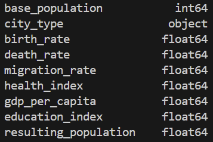
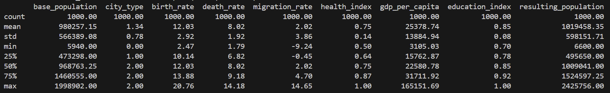
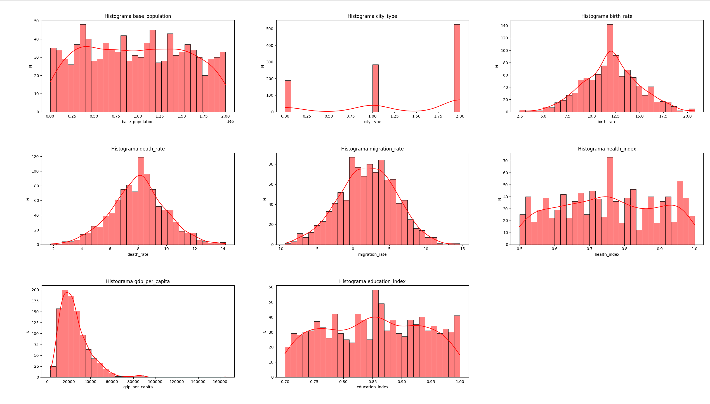
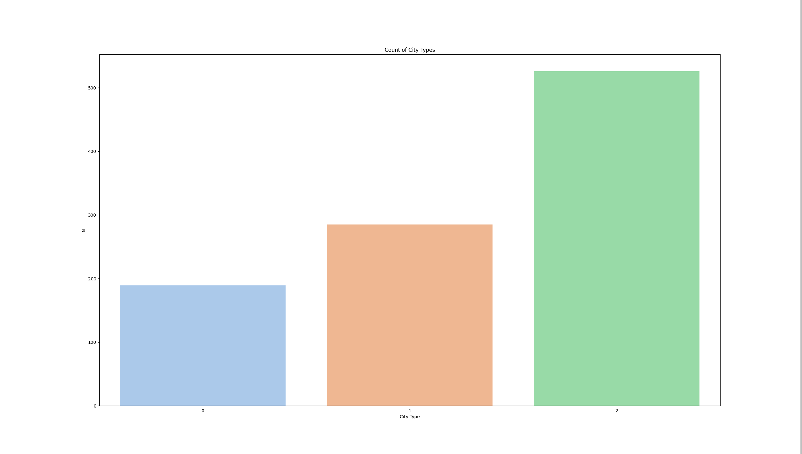
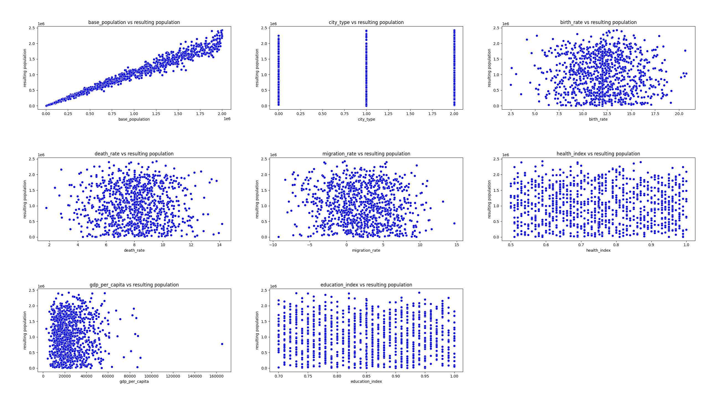
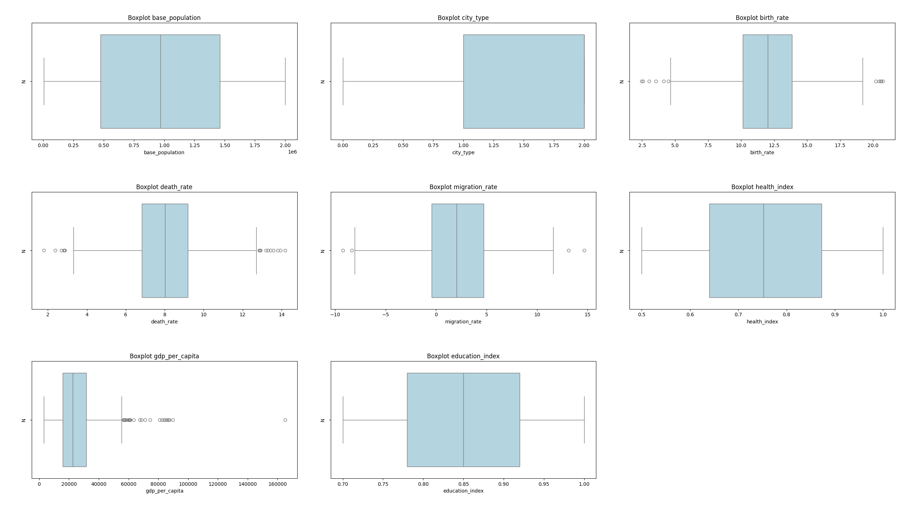
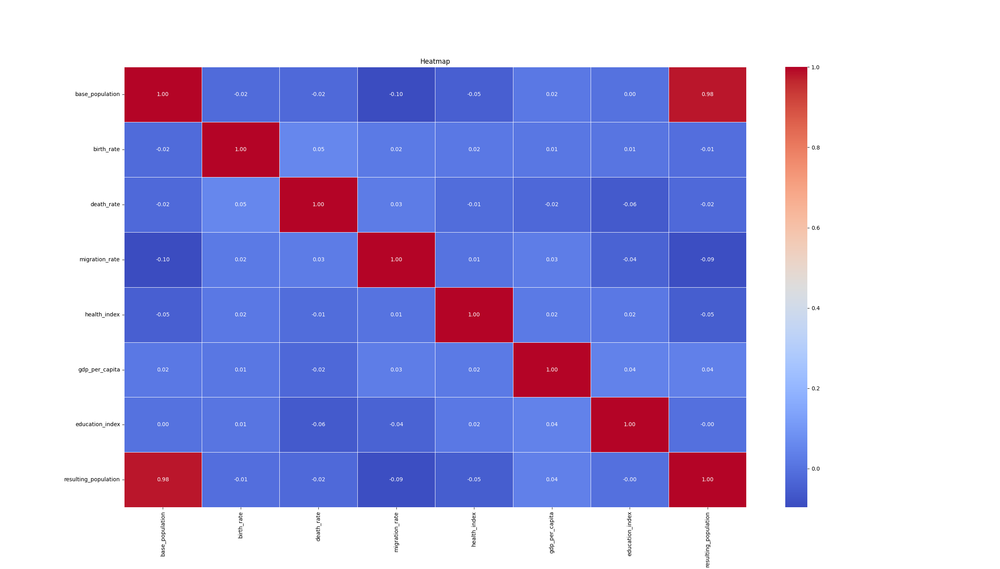
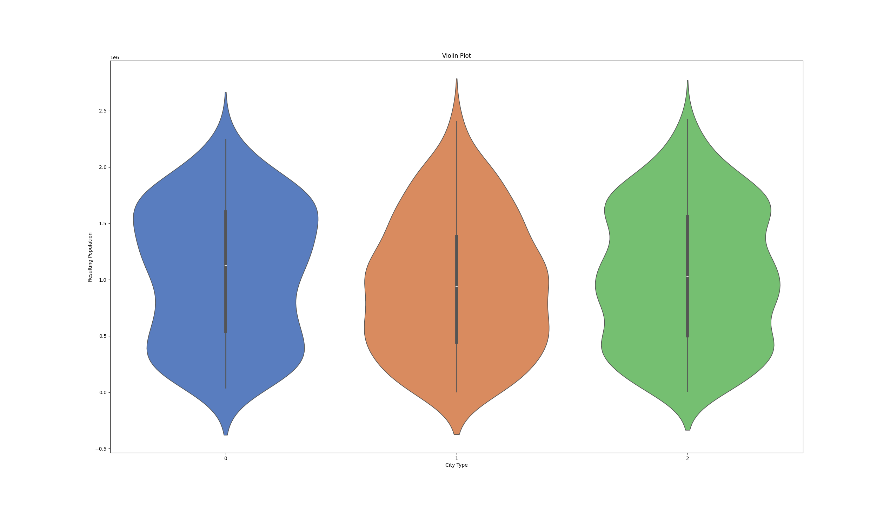
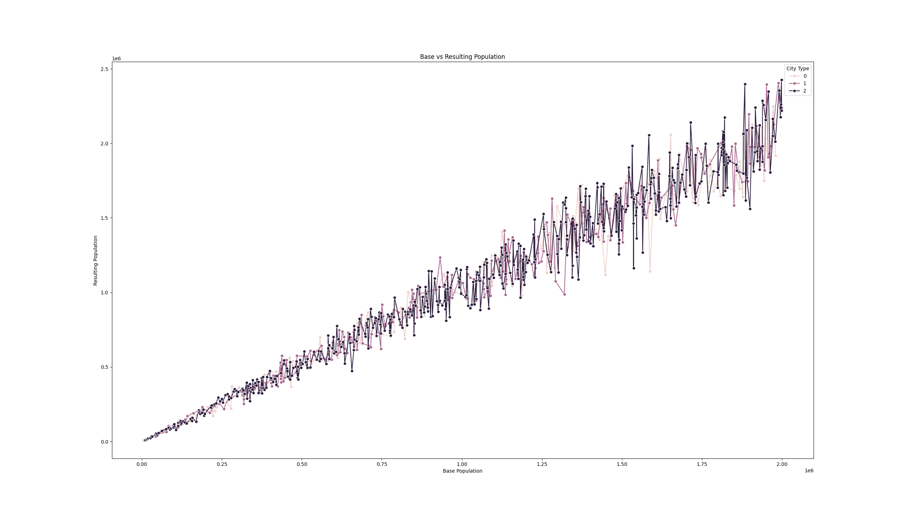
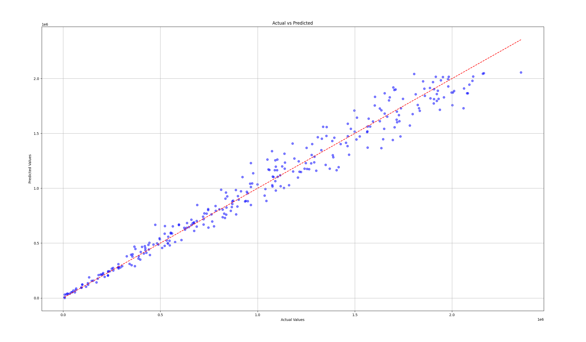

Mirea Matei Nicolae 314CA

# Population Evolution

## Scop si Setup

Ne vom pune urmatoarea problema. Putem prezice evolutia populatiei unei asezari umane, pe 10 ani? Raspunsul este putem aproxima suficient. 
Trebuie mai intai sa generam un set de date, sa alegem o formula. Vom genera 1000 de cazuri, si vom folosi 700 pt train si 300 pt test. Vom folosi regresia pntru a calcula populatia peste 10 ani a unui asezari umane.
Vom salva in X_train, X_test, Y_train s Y_test, toate fiind .csv, tabele de valori si numere.

## Caracteristici

Deci avem urmatoarele date:

Populatia va fi un numar intreg, evident, apoi tipul de oras va apartine uneia din urmatoarele: rural, industrial, modern. Apoi  avem doar variabile de tip float, rata de natalitate, mortalitate, bilantul de migratie. Acestea impreuna sunt bilantul total al populatiei. Apoi avem niste factori, considerati de mine personal importanti in calculul evolutiei unei societati, educatia, PIB per capita si sanatatea.

## Formula aleasaVom calcula un growth_rate, pe care il vom inmulti la final ca sa obtinem noua populatie.

Acesta se calculeaza in felul rumator: Notam cu X growth_rate
X = N – M + BM
Unde N este birth_rate, M este death_rate, BM este migration rate. (nascuti vii, morti, bilant migratoriu).
X = X / 1000
Pt fiecare tip de asezare avem :  Notam numar random interval cu nr
X = X * nr
Unde intervalul este 1.1 1.2 pt rural, 1.0 1.1 pt industrial 1.5 2.0 pt modern
Apoi
X = X * 0.001 * health_index
X = X * 0.002 * education_index
X = X * 0.001 * (gdp_per_capita / 1000)
Apoi tebuie sa luam in calcul un factor random deci vom avea
Populatia_rezultanta = Populatia_start * (1 + X + nr (0, 0.1)).

## Statistici de descriere

# Distributia Variabilelor

## Histograma

## Club orase

# Outlieri

## Scatter

## Box

# Corelatii

## Heatmap

## Violin

# Lineplot pentru populatie la inceput vs dupa 10 ani, cu legenda tipului de asezare

# Antrenare si regresia liniara

Folosim MAE pt regresie (Mean Absolute Error), vom obtine eroare de 73 * 10^4, care pentru selectia de populatie (5000, 2000000), este una foarte buna (populatia este generata ca un numar intre 5000 si 200000).

